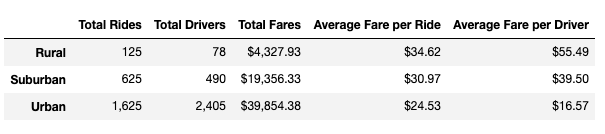
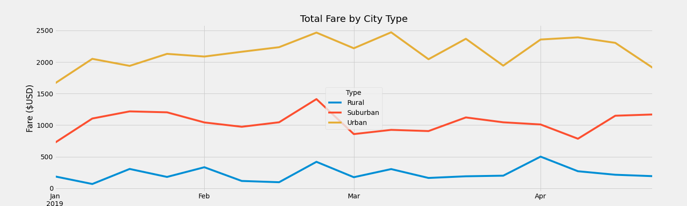

# PyBer_Analysis

## Overview of the Analysis
PyBer is a ride sharing service. The purpose of this analysis is to visualize a summary of Pyber's ride-sharing data by city type. We will also plot the weekly fares for each city type from January through April. The three city types that Pyber services are: Urban, Suburban and Rural.

## Results

The below chart highlights the key differences between different city types.
</img>

- ### Total Rides ###

    As noted above, the Urban city type has the most amount of rides in this dataset. Urban cities combined provided nearly 3 times the amount of rides compared to Suburban cities and 13 times more rides than Rural cities.

    Suburban cities provide the second highest amount of rides and Rural cities provide the least amount of rides.

    This data can be expected, considering population size which defines rural, suburban and urban city types.

- ### Total Drivers ###
    
    There are fewer total drivers in Suburban and Rural areas compared to the number of rides. This indicates that more drivers are utilizing PyBer as a heavier source of their income.

    There are more drivers than rides in Urban cities suggesting that there are a higher percentage of part time and casual drivers, and many drivers did not actually provide any rides in this data set.

- ### Total Fares ###
    Urban cities have generated the most revenue, bringing in nearly $40K in fares. Suburban cities ranked second in revenue at almost $20K and Rural cities brought in over $4K of revenue.

- ### Average fare per ride ###

    Urban cities have the lowest average fare per ride, at $24.53, suggesting that urban travellers are going slightly shorter distances. 

    Suburban cities have the second highest average fare per ride at $30.97, this infers that some suburban travellers are going longer distances (perhaps to urban areas) and some are staying close to home.

    Rural cities have the highest average fare per ride at $34.62. This indicates that on average, rural travellers need to go further distances for day-to-day activities.

- ### Average fare per driver ###
    Rural cities have the highest average fare per driver of the three at $55.59 per driver. There is also the lowest ratio of drivers per rides in this city type.

    Suburban cities have an average fare per driver of $39.50 and Urban cities have an average fare per driver of $16.57.
    

### **Total Weekly Fare by City Type** ###

</img>
    The weekly fare per city type data shows us that Urban cities consistently provide the highest total fares, followed by Suburban and Rural cities. The three city types follow different overall trajectories indicating different driving needs throughout the 16 week period.

## Summary
*Provide Three business recommendations to the CEO for addressing any disparities among the city types.*
1. Because there is a greater population in Urban areas, the data supports that this should be the area with the highest income for PyBer with the most rides and drivers. 

    One area that could be further researched is that there are many drivers that are providing zero rides in our dataset. If this is a finding of concern (lost revenue or cost to PyBer) it would be worth researching why drivers are not driving (maybe due to the low average fare per driver?) and which urban cities are most greatly affected. 

2.  The average fare per driver is significantly lower in the Urban cities, likely related to having many drivers not actually driving. However, there could be other reasons and it will important to understand if this trend is due to low demand, shorter distances travelled or over-saturated driver count. 

3.  According to our Weekly Fare by City Type graph, mid-february seems to have a peak in fares in all city types. Perhaps this is attributed to a holiday (such as Valentine's Day)? Or perhaps there was poor weather in the whole region? It could be interesting for the CEO to see if this is a consistent trend across the years.          
    Early April has a peak in Rural and Urban city types, similar research could be done to see if there are any data that suggests that this could be a pattern across the years.

